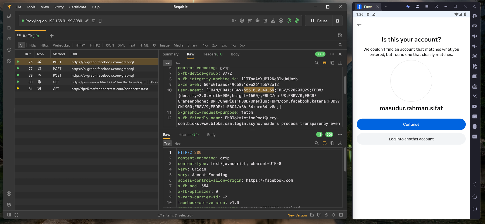

<div align="center">


<br/>


<br/>


</div>

---

## 📌 About

**Facebook SSL Pinning Bypass** is a security research repository by **[Mr-SxR](https://github.com/Mr-SxR)** — it provides pre-patched `libcoldstart.so` native libraries for the official Facebook Android application, enabling HTTPS traffic interception for educational analysis.

> Built and maintained by **Masudur Rahman Sifat** — a self-taught reverse engineer & Python developer from Bangladesh, operating under the **Mr-SxR** brand *(Speciality & Reliability)*.

---

## 📦 Library Info

| | |
|---|---|
| **Package** | `com.facebook.katana` |
| **App Version** | `555.0.0.49.59` |
| **Architectures** | `ARM64-v8a` · `x86_64` · `x86` |
| **Bypass Method** | Binary patch — SSL verification skipped at entry point |

> 💡 Lib only works with the exact Facebook version listed above.

> ❓ Questions? → [](https://t.me/sifathub)

---

## 📸 Evidence

> Traffic captured via **Reqable** after replacing `libcoldstart.so` on a rooted device.



---

## ⬇️ Downloads

**Package:** `com.facebook.katana`

---

### ARM64 — Physical Android Devices

| | |
|---|---|
| 📦 **libcoldstart.so** | [](https://github.com/Mr-SxR/Facebook-SSL-Pinning-Bypass/raw/main/ARM64/libcoldstart.so) |
| 📱 **Facebook APK** | [](https://www.apkmirror.com/apk/facebook-2/facebook/facebook-555-0-0-49-59-release/) |

> 💡 Pick variant: `arm64-v8a` · `nodpi` · APK type (not Bundle)

---

### x86_64 — Android Emulators

| | |
|---|---|
| 📦 **libcoldstart.so** | [](https://github.com/Mr-SxR/Facebook-SSL-Pinning-Bypass/raw/main/x86_64/libcoldstart.so) |
| 📱 **Facebook APK** | [](https://www.apkmirror.com/apk/facebook-2/facebook/facebook-555-0-0-49-59-release/) |

> 💡 Pick variant: `x86_64` · `nodpi` · APK type (not Bundle)

---

### x86 — Android Emulators

| | |
|---|---|
| 📦 **libcoldstart.so** | [](https://github.com/Mr-SxR/Facebook-SSL-Pinning-Bypass/raw/main/x86/libcoldstart.so) |
| 📱 **Facebook APK** | [](https://www.apkmirror.com/apk/facebook-2/facebook/facebook-555-0-0-49-59-release/) |

> 💡 Pick variant: `x86` · `nodpi` · APK type (not Bundle)

---

## ⚙️ Requirements

- ✅ **Rooted** device — to access the app's lib directory & bypass Android Trust Manager
- ✅ **Facebook APK** installed
- ✅ **ADB** or **MT Manager** — to replace `libcoldstart.so` inside the app directory
- ✅ **Burp Suite** / **Reqable** / **HTTP Canary** — installed with CA certificate configured

---

## 🔧 Setup Process

### Step 1 — Replace libcoldstart.so

Download the patched lib from the **Downloads** section above and replace the original at:

```
/data/data/com.facebook.katana/lib-compressed/libcoldstart.so
```

**Backup (optional):** You can backup the original before replacing — entirely up to you.

**Replace via ADB:**
```bash
adb push [Patched-libcoldstart.so-Path] /data/data/com.facebook.katana/lib-compressed/libcoldstart.so
```

> 💡 **MT Manager** — you can also replace the file directly on your device (Android or emulator) using MT Manager, without needing ADB.

---

### Step 2 — CA Certificate Setup *(if needed)*

**Burp Suite / Reqable / HTTP Canary** — whichever you use, make sure the CA certificate is installed on your device.

> If not installed, install the CA certificate of your respective proxy app.

---

### Step 3 — Set Proxy & Capture Traffic

**Using Burp Suite or Reqable (PC-based):**

> This step is only required when using a PC-based proxy tool. The proxy runs on your PC, so your device needs to route its traffic through it manually.

1. Open Burp Suite / Reqable on your PC and set it to listen on all interfaces
2. On your device: `WiFi Settings → Long press network → Modify → Proxy → Manual`  
   → Enter your **PC's local IP** and the **proxy port** (e.g. `8080`)
3. Launch Facebook → perform any action → all traffic will appear in your proxy tool

**Using HTTP Canary (Mobile-only):**

> No manual WiFi proxy setup needed. HTTP Canary uses Android's built-in VPN system to intercept traffic automatically — just open the app, start capturing, and launch Facebook.


## ⚠️ Disclaimer

This repository is shared for security research to help understand how SSL pinning works in native Android libraries and how it can be bypassed.

The goal is learning. Understanding certificate validation in `libcoldstart.so`, native-level binary patching, and traffic interception helps developers build more secure applications.

Not for malicious use. Use only on devices or accounts you own or have permission to test. The developer is not responsible for any misuse or consequences.

---

## 🛠️ Need Custom Work?

> Looking for something specific? I take custom orders.

- 🔓 **Non-rooted device SSL bypass APK** — patched full APK, no root needed
- 🆕 **Latest version bypass** — updated patch for the newest Facebook release
- 📱 **Other apps** — SSL bypass for other Android applications

Reach out on Telegram → [](https://t.me/sifathub)

---

## 📬 Contact

[](https://www.facebook.com/sifathub)
[](https://wa.me/+8801858094178)
[](https://t.me/sifathub)

> Feel free to reach out for any questions, issues, or custom requests — I'm always available.

---

<div align="center">

***[Mr-SxR](https://github.com/Mr-SxR)** — Speciality & Reliability*

</div>
